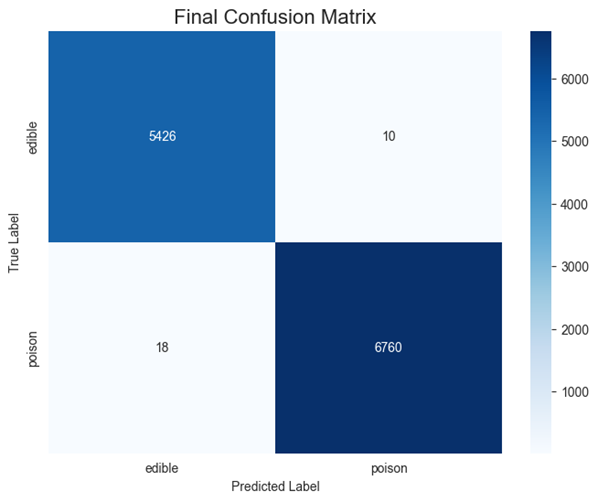
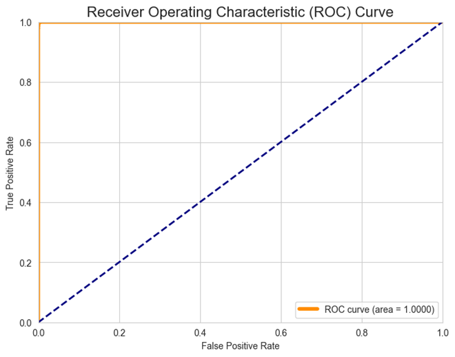

---

## 🍄 End-to-End Mushroom Classification: Edible vs. Poisonous

### Introduction

This project develops a **binary classification model** to predict whether a mushroom is **edible ('e')** or **poisonous ('p')** based on a diverse set of morphological and environmental features.The model is built and validated using a structured machine learning workflow, employing a dataset sourced from Kaggle.

### Dataset Overview 

* The dataset contains **61,069 entries** and **21 features**.
* The target variable, `class` (edible vs. poisonous), is balanced.
    * Poisonous ('p'): 53.7% of instances.
    * Edible ('e'): 46.3% of instances.

### 🛠️ Project Flow and Methodology 

#### Exploratory Data Analysis (EDA) & Data Cleaning 

* **Missing Value Strategy:**
    * Columns with a missing value fraction greater than 40% were **dropped** from the dataset.
    * The dropped columns were: `gill-spacing`, `stem-root`, `stem-surface`, `veil-type`, `veil-color`, and `spore-print-color`.
    * Remaining missing values in columns like `cap-surface`, `gill-attachment`, and `ring-type` were **imputed** using the mode of the respective column.
* **Outlier Treatment:** Outliers in numerical features (`cap-diameter`, `stem-height`, `stem-width`) were identified using boxplots and are handled via a capping technique.

#### Data Preprocessing Pipeline 

A unified machine learning pipeline was constructed using `Pipeline` and `ColumnTransformer` to ensure consistent application of preprocessing steps:

* **Categorical Features:** Encoded using **`OneHotEncoder`**.
* **Numerical Features:** Scaled using **`StandardScaler`**.

#### Model Training and Evaluation 

* Several classification algorithms were trained and evaluated on the test set.
* **Hyperparameter tuning** was performed using **`GridSearchCV`** with **5-fold cross-validation**, optimizing for the **ROC-AUC score**.

### 📊 Key Results and Model Selection 

Multiple models achieved near-perfect classification performance on the test set, demonstrating the high predictability of the target variable from the available features.

| Model | Accuracy | Precision | Recall | F1-Score | ROC AUC |
| :--- | :--- | :--- | :--- | :--- | :--- |
| Random Forest | 0.997134 | 0.998816 | 0.996017 | 0.997414 | 0.999975 |
| K-Nearest Neighbors | 0.996807 | 0.997784 | 0.996459 | 0.997121 | 0.999701 |
| Support Vector Machine | 0.995415 | 0.994119 | 0.997639 | 0.995876 | 0.999297 |
| Decision Tree | 0.995006 | 0.997482 | 0.993508 | 0.995491 | 0.997019 |
| Logistic Regression | 0.780825 | 0.797476 | 0.811006 | 0.804184 | 0.856830 |
| Naive Bayes | 0.710169 | 0.701118 | 0.832694 | 0.761262 | 0.784034 |
| AdaBoost | 0.707467 | 0.727144 | 0.756860 | 0.741705 | 0.701370 |

The **Random Forest Classifier** was selected as the final model due to its robust ensemble performance and a perfect **ROC-AUC score of 1.0000** achieved after Grid Search optimization.

---

**Final Confusion Matrix**

**(ROC) Curve**

---

### 🚀 Deployment 

* **Model Persistence:** The final, optimized pipeline is saved as `final_model_pipeline.joblib`.
* **Web Application:** A basic web application is simulated using the **Gradio** library to demonstrate a simple, user-friendly interface for real-time model predictions.
"# mushroom_classification-Edible-vs.-Poisonous" 
